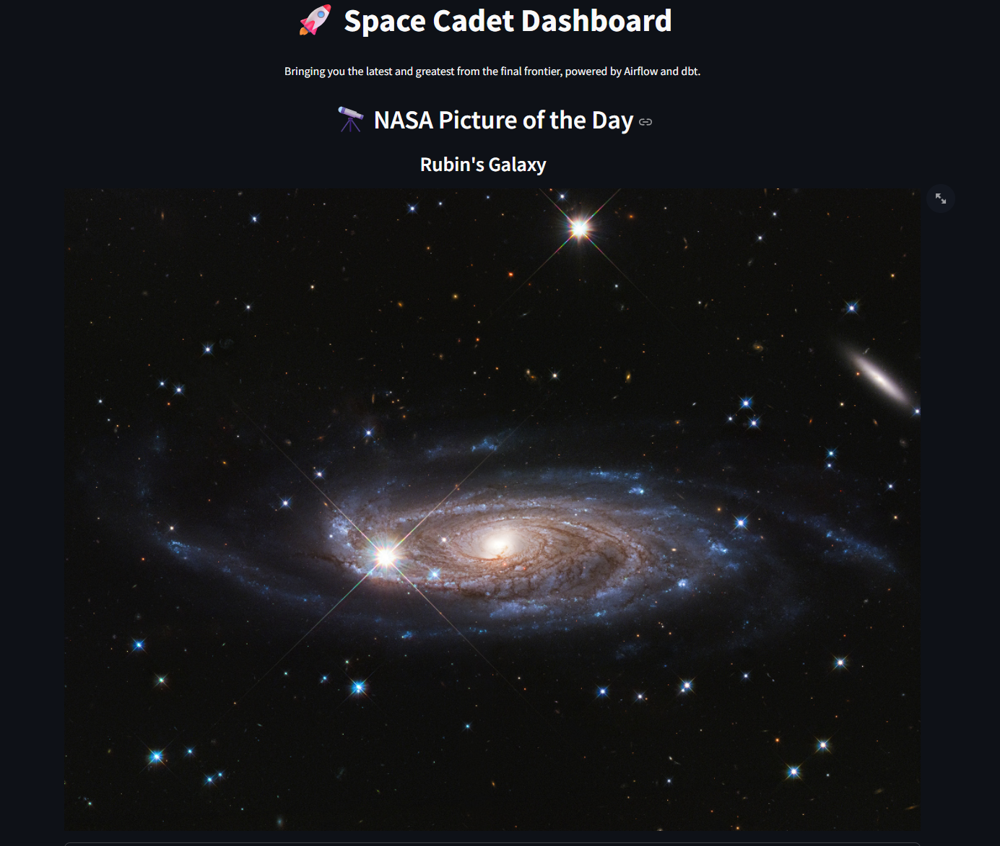
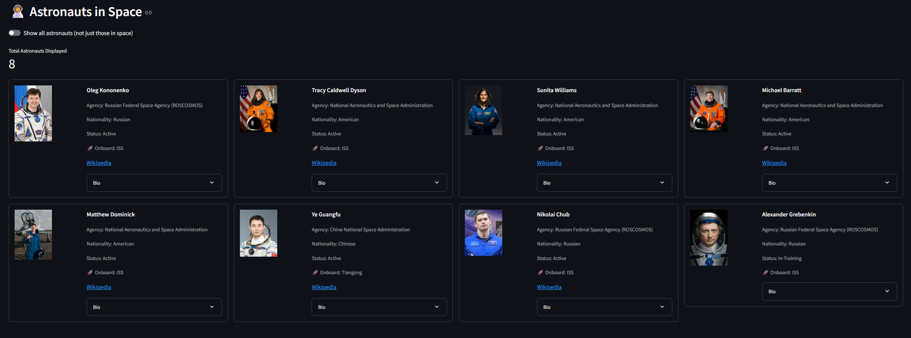
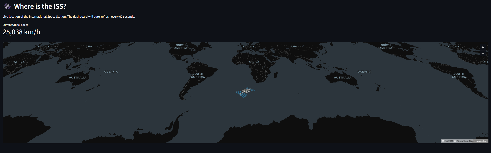
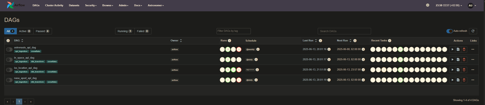

```
 _ 
 \`*-.    
  )  _`-. 
 .  : `. . 
 : _   '  \ 
 ; *` _.   `*-._
 `-.-'          `-.
   ;       `       `.
   :.       .        :
   . \  .   :   .-'   . 
   '  `+.;  ;  '      :
   :  '  |    ;       ;-.
   ; '   : :`-:     _.`* ;
 .*' /  .*' ; .*`- +'  `*'
*-*   `*-*   `*-*'
```
# 🚀 Snowflake ELT Dashboard

A batch data pipeline and analytics platform that connects to space-related APIs, processes the data through Snowflake, and creates an interactive dashboard.





## 🌟 Features

- **Real-time ISS tracking** with speed and location visualization
- **Astronomy Picture of the Day** from NASA's API
- **Astronaut database** showing who's currently in space
- **Fully automated data pipeline** using Airflow with dynamic DAG generation
- **Transformations in Snowflake** using dbt Core

## 🏗️ Architecture

```
┌───────────┐    ┌──────────┐    ┌───────────┐    ┌────────────┐
│  External  │    │          │    │           │    │            │
│   APIs     │───►│  Airflow │───►│ Snowflake │───►│ Streamlit  │
│            │    │          │    │           │    │            │
└───────────┘    └──────────┘    └───────────┘    └────────────┘
```


The project implements a full ELT pipeline:
- **Extract**: API data is fetched using dynamic DAGs and Python scripts orchestrated by Airflow
- **Load**: Raw data is loaded into Snowflake through the same orchestration framework
- **Transform**: Data is modeled using dbt Core with a layered approach

## 🚀 Quick Start with GitHub Codespaces

The fastest way to explore this project is with GitHub Codespaces, which automatically sets up the development environment.

[](https://codespaces.new/spacekittie/its-full-of-stars)

The Makefile will automatically trigger Terraform infrastructure creation on Snowflake and appropriate roles and permissions required for the project as part of the setup process (e.g., when running `make all` or `make infra-apply`).

### Steps in Codespaces:

1. **Set up environment**:
   ```bash
   # Copy the example environment file
   cp .env.example .env
   # Edit .env with your Snowflake credentials
   ```
2. **Run the full setup**:
   ```bash
   make all
   ```
3. **Access Airflow** via the Codespaces ports tab (port 8080)
   - Trigger the DAGs to start data collection

4. **Launch the dashboard**:
   ```bash
   make dashboard
   ```

## 💻 Local Development Setup

### Prerequisites

- Docker (for running Airflow via Astro Runtime)
- Snowflake account with admin privileges
- Python 3.9+ (if running Streamlit locally)

### Installation

1. **Clone the repository**:
   ```bash
   git clone https://github.com/spacekittie/its-full-of-stars.git
   cd its-full-of-stars
   ```
2. **Set up environment**:
   ```bash
   # Copy the example environment file
   cp .env.example .env
   # Edit .env with your Snowflake credentials
   ```
3. **Run the full setup**:
   ```bash
   make all
   ```
4. **Access Airflow** via the Codespaces ports tab (port 8080)
   - Trigger the DAGs to start data collection

5. **Launch the dashboard**:
   ```bash
   make dashboard
   ```

## 🧰 Project Structure

```
.
├── astro/                  # Airflow project directory
│   ├── dags/               # Airflow DAGs
│   │   └── api_factory.py  # Dynamic DAG generator
│   ├── dbt/                # dbt project
│   │   ├── models/         # Data models
│   │   │   ├── airlock/    # Intermediate models
│   │   │   └── mission_control/ # Final models
│   └── include/            # Python modules for DAGs
│       └── utils/          # Shared utilities
│           ├── api_strategy.py  # Strategy pattern implementation
│           └── snowflake_loader.py # Data loading utility
├── infra/                  # Terraform configuration
├── .env.example            # Example environment variables
├── Makefile                # Project automation
├── streamlit_app.py        # Dashboard application
└── README.md               # This documentation
```

## 🛠️ Make Commands

| Command | Description |
|---------|-------------|
| `make all` | Full setup: infrastructure, dbt init, and Airflow startup |
| `make setup` | Generate Terraform and Streamlit config from .env |
| `make infra-apply` | Apply Terraform changes to Snowflake |
| `make dbt-init` | Initialize raw tables in Snowflake |
| `make up` | Start Airflow  |
| `make down` | Stop Airflow |
| `make dbt-run` | Run dbt transformations |
| `make dashboard` | Start Streamlit dashboard |

## 📝 Notes

- When running locally outside of Codespaces, ensure all prerequisites are properly installed
- The project is configured for automation in Codespaces, so local setup might need adjustments
- Check Airflow logs if data isn't showing up in the dashboard
- Tear down infrastructure when done: `make infra-destroy`
- Clean up the generated files: `make clean`
